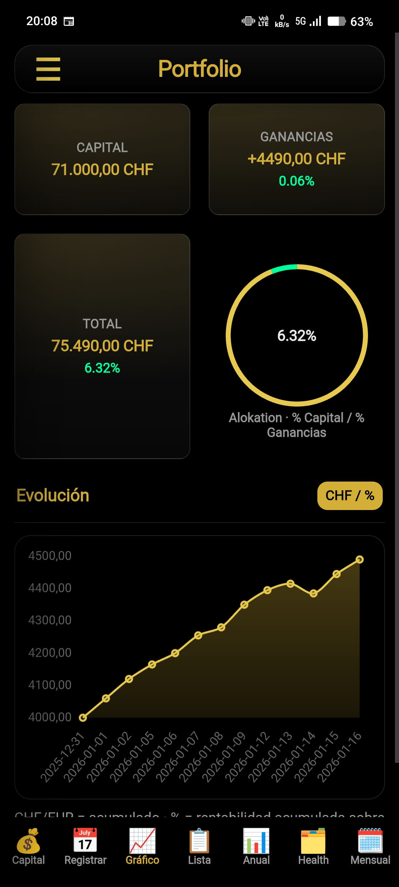
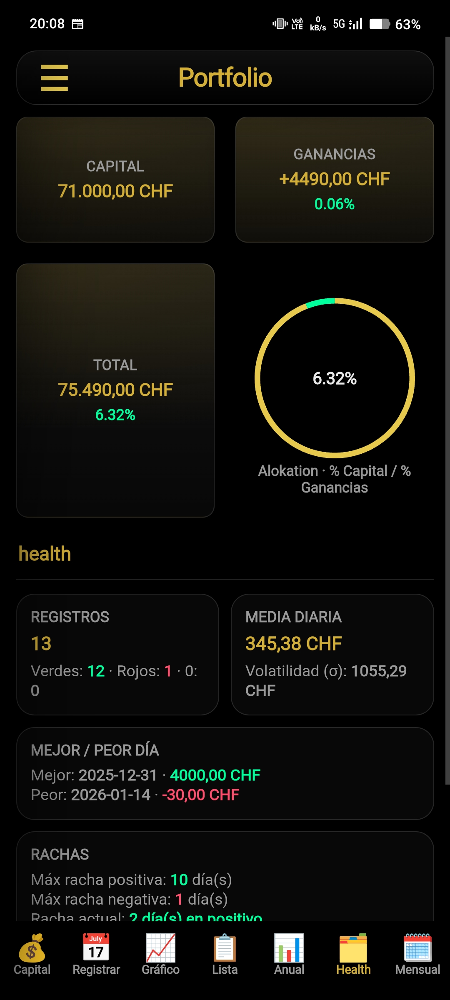

# 📊 Portfolio – Control personal de ganancias

**Portfolio** es una aplicación web progresiva (PWA) pensada para **controlar de forma simple y privada las ganancias de una cartera**, sin cuentas, sin registros y sin depender de bancos o servicios externos.

La app fue creada para uso personal, con el objetivo de tener una visión clara del capital, las ganancias y la evolución en el tiempo, manteniendo **todos los datos en el propio dispositivo**.

---

## ✨ Características principales

- 💰 **Control de capital inicial**
- 📅 **Registro diario de ganancias o valor total**
- 📈 **Gráficos de evolución**
- 📊 **Resumen anual y mensual**
- 🗂️ **Health**: estado general de la cartera  
  (histórico inteligente, consistencia y rendimiento)
- 🎯 **Objetivos anuales con progreso**
- 🔒 **Privacidad total**: los datos se guardan solo en tu dispositivo
- 📶 **Funciona offline**
- 📱 **Instalable como app** (PWA) en móvil y escritorio

---

## 🗂️ Health

La sección **Health** ofrece una visión global del estado de la cartera, más allá del beneficio puntual:

- Consistencia en el tiempo
- Días positivos vs negativos
- Mejores y peores resultados
- Evolución del rendimiento

Pensada para responder de forma rápida a una pregunta clave:

> **¿Cómo está mi cartera ahora mismo?**

---

## 🔐 Privacidad y filosofía

- No hay cuentas de usuario  
- No hay login  
- No hay servidores  
- No hay tracking  

Todo se guarda localmente usando `localStorage`.  
Tú controlas tus datos.

---

## 🖥️ Cómo usar la app

1. Abre la aplicación desde el navegador:
   👉 **[Abrir Portfolio](https://nel99.github.io/portfolio-nel/)**

2. En móvil:
   - Menú del navegador
   - **“Añadir a la pantalla de inicio”**
   - Se instalará como una app real (sin barra del navegador)

3. Define tu capital inicial y empieza a registrar tus resultados.

---

## 🛠️ Tecnologías usadas

- HTML, CSS y JavaScript puro
- Chart.js para gráficos
- Progressive Web App (PWA)
- Service Worker para uso offline
- GitHub Pages para despliegue

---

## 📦 Estado del proyecto

El proyecto está **en desarrollo activo**.  
La app ya es totalmente funcional, y se siguen añadiendo mejoras, especialmente en la sección **Health**.

---

## 💡 Motivación

Existen muchas apps de inversión, pero la mayoría:
- requieren cuentas
- suben datos a la nube
- son complejas para un uso diario sencillo

Esta app nace como una **herramienta personal, directa y privada**, pensada para personas que solo quieren saber:

> **¿Cómo va mi dinero y qué tal está mi cartera?**

---

## 🤝 Contribuciones y feedback

Cualquier sugerencia, idea o feedback es bienvenido.  
Si te resulta útil y quieres aportar mejoras, no dudes en comentarlo.

---

## 📄 Licencia

Proyecto personal de uso libre.  
Consulta el repositorio para más detalles.
## 📱 Capturas

### Pantalla principal

